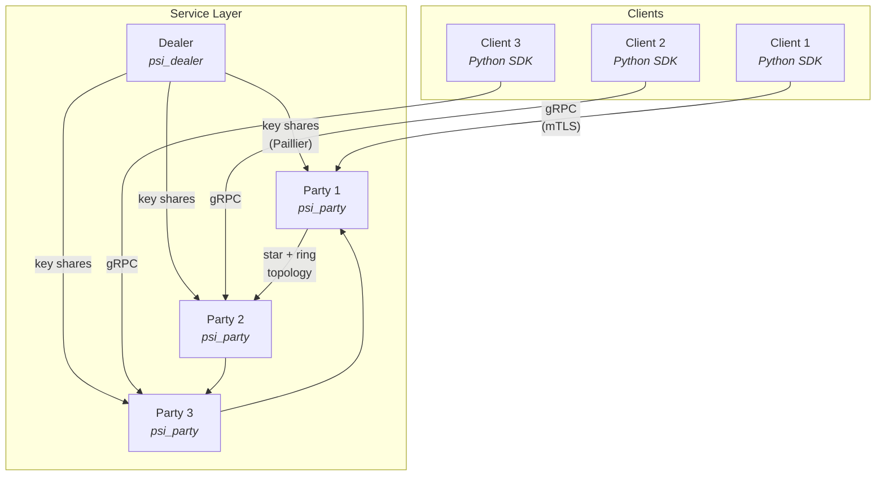

# psinsieme

Experimental implementations of multi-party Private Set Intersection (PSI) protocols for research and evaluation.

## Protocols

| Protocol | Reference | Experiment | Service |
|----------|-----------|------------|---------|
| KS05 Threshold MPSI | Kissner & Song, CRYPTO 2005 [[doi]](https://doi.org/10.1007/11535218_15) | [experiments/ks05](experiments/ks05/) | [service](service/) |
| BEH21 Threshold MPSI | Bay et al., IEEE TIFS 2021 [[doi]](https://doi.org/10.1109/TIFS.2021.3118879) | [experiments/beh21](experiments/beh21/) | [service](service/) |
| YYH26 T-Threshold MPSI | TBD, NDSS 2026 | [experiments/yyh26](experiments/yyh26/) | [service](service/) |
| XZH26 EC-ElGamal Bloom OPPRF MPSI | TBD | [experiments/xzh26](experiments/xzh26/) | [service](service/) |

The repository has two layers:

- **`experiments/`** — Standalone academic reference implementations that communicate over plaintext TCP. Useful for benchmarking and understanding each protocol in isolation.
- **`service/`** — A gRPC-based production framework with mTLS, threshold key distribution, per-request protocol selection, and a Python client SDK. See [service/README.md](service/README.md) for the full usage guide.
- **`webapp/`** — A browser console over the service: run protocols, auto-start a local cluster, and view intersections without the shell. See [webapp/README.md](webapp/README.md).

## Installation

There are two supported install paths. Use Docker for the fastest web-console setup, or build from source when you need local development, custom compiler flags, or optional YYH26 builds.

### Option 1: Docker Hub image

The published image includes the web console, Python client runtime, frontend assets, and prebuilt `psi_party` / `psi_dealer` binaries with KS05, BEH21, and XZH26 enabled.

```bash
docker pull gugugaga001/psinsieme:latest

docker run --rm \
  -p 127.0.0.1:38888:38888 \
  -e PSINSIEME_WEB_HOST=0.0.0.0 \
  -e PSINSIEME_WEB_PUBLIC_BIND=1 \
  gugugaga001/psinsieme:latest
```

Open <http://127.0.0.1:38888>. For a pinned build, use `gugugaga001/psinsieme:slim-20260530` (`sha256:81453a39cfa76e8794426cef399db69726c598e2272cf36b910d6c221f11005a`).

For non-local exposure, set `PSINSIEME_WEB_TOKEN` and send it as `X-PSINSIEME-Token` on POST APIs. The command above publishes the container only on host loopback.

### Option 2: Build from source

Install the prerequisites below, then build the service and frontend locally:

```bash
mkdir -p build && cd build
cmake ..
make -j$(nproc)
cd ..

cd webapp/frontend
npm install
npm run build
cd ..
pip install -r requirements.txt
bash run.sh
```

Open <http://127.0.0.1:38888>.

## Architecture



## Prerequisites

### Core (service)

The default service build compiles **KS05 + BEH21 + XZH26** (YYH26 is opt-in; see below).

- C++20 compiler (GCC 10+ or Clang 15+)
- CMake 3.16+
- [NTL](https://libntl.org/) (Number Theory Library)
- [GMP](https://gmplib.org/) (GNU Multiple Precision)
- [gRPC](https://grpc.io/) and [Protobuf](https://protobuf.dev/)
- [libsodium](https://libsodium.org/) and [Boost](https://www.boost.org/) (system, thread) — needed by XZH26
- The `experiments/yyh26/upstream` git submodule — XZH26 reuses its cryptoTools sources and prebuilt miracl

```bash
# Ubuntu/Debian
sudo apt install build-essential cmake libntl-dev libgmp-dev \
    libgrpc++-dev protobuf-compiler-grpc libprotobuf-dev \
    libsodium-dev libboost-system-dev libboost-thread-dev

# XZH26 needs the upstream submodule (cryptoTools + miracl):
git submodule update --init experiments/yyh26/upstream
```

To skip XZH26 (and avoid libsodium / the submodule), configure with `-DMPSI_BUILD_XZH26=OFF`.
BEH21 has no extra dependencies; disable it with `-DMPSI_BUILD_BEH21=OFF` if desired.

### Experiments (KS05/BEH21)

All of the above, plus:

- [Boost](https://www.boost.org/) (system, thread, ASIO)
- [cryptoTools](https://github.com/ladnir/cryptoTools), [coproto](https://github.com/Visa-Research/coproto), [volePSI](https://github.com/Visa-Research/volePSI), [libOTe](https://github.com/osu-crypto/libOTe)

```bash
sudo apt install libboost-all-dev
```

### YYH26 (experiment or service)

All of the above, plus:

- nasm, MPFR, Google Benchmark
- Miracl, libOTe, libOLE (built from source via setup scripts)

```bash
sudo apt install nasm libmpfr-dev libbenchmark-dev
```

For the YYH26 experiment, see [experiments/yyh26/README.md](experiments/yyh26/README.md) for build instructions.
For YYH26 in the service, see [service/README.md](service/README.md#yyh26-tt-mpsi-protocol).

## Quick Start

### Docker web console (fastest)

```bash
docker pull gugugaga001/psinsieme:latest

docker run --rm \
  -p 127.0.0.1:38888:38888 \
  -e PSINSIEME_WEB_HOST=0.0.0.0 \
  -e PSINSIEME_WEB_PUBLIC_BIND=1 \
  gugugaga001/psinsieme:latest
```

Open <http://127.0.0.1:38888>. The container includes the web console and prebuilt service binaries, so no local CMake, Node, or Python setup is needed.

For a pinned image, use `gugugaga001/psinsieme:slim-20260530` (`sha256:81453a39cfa76e8794426cef399db69726c598e2272cf36b910d6c221f11005a`).

### Source build service

```bash
mkdir -p build && cd build
cmake ..
make -j$(nproc)
```

This produces `psi_party` and `psi_dealer` under `build/service/`, with KS05, BEH21, and XZH26 compiled in.

Run the demo:

```bash
bash service/demos/ks05/demo.sh      # 3-party KS05 with dealer
bash service/demos/beh21/demo.sh     # 3-party BEH21 with dealer (built by default)
bash service/demos/yyh26/demo.sh     # 3-party YYH26 (opt-in: -DMPSI_BUILD_YYH26=ON -DMPSI_BUILD_XZH26=OFF)
```

> **XZH26 and YYH26 are mutually exclusive** in a single `psi_party` — they vendor conflicting copies of cryptoTools/osuCrypto. XZH26 is on by default; to build YYH26 instead, configure with `-DMPSI_BUILD_YYH26=ON -DMPSI_BUILD_XZH26=OFF`. The build fails fast if both are enabled.

See [service/README.md](service/README.md) for usage, mTLS setup, and API reference.

### Web console

A browser UI over the service — run protocols and view intersections without the shell. After building the service above:

```bash
cd webapp/frontend && npm install && npm run build && cd ..
pip install -r requirements.txt   # grpcio + protobuf (server itself is stdlib-only)
bash run.sh                       # serves UI + API on http://127.0.0.1:38888
```

Requires Node.js 18+ and Python 3.10+. See [webapp/README.md](webapp/README.md) for modes and configuration.

### Experiments

```bash
mkdir -p build && cd build
cmake .. -DBUILD_EXPERIMENTS=ON
make -j$(nproc)
```

Per-protocol flags: `-DBUILD_KS05=ON` (default), `-DBUILD_BEH21=ON` (default), `-DBUILD_YYH26=OFF` (requires extra deps).

Binaries are produced under `build/experiments/<protocol>/`.

## Structure

```
psinsieme/
├── experiments/          # Academic reference implementations (plaintext TCP)
│   ├── shared/          # Shared crypto (paillier, defines, logger)
│   ├── ks05/            # Kissner-Song CRYPTO'05 T-MPSI
│   ├── beh21/           # Bay et al. TIFS'21 OT-MPSI
│   ├── yyh26/           # YYH26 NDSS'26 TT-MPSI
│   ├── xzh26/           # XZH26 EC-ElGamal Bloom OPPRF MPSI
│   └── tools/           # Shared benchmark scripts
├── service/             # gRPC service framework (mTLS, dealer, Python client)
│   ├── proto/           # Protobuf definitions
│   ├── core/            # Shared transport layer and protocol registry
│   ├── protocols/       # Protocol implementations (ks05, yyh26)
│   ├── party/           # Client-facing gRPC service (psi_party binary)
│   ├── dealer/          # Key dealer service (psi_dealer binary)
│   ├── clients/python/  # Python client SDK
│   ├── demos/           # End-to-end demo scripts
│   ├── certs/           # mTLS certificate generation
│   └── tests/           # Integration and unit tests
└── webapp/              # Browser console over the service
    ├── server.py        # Stdlib HTTP server (UI + JSON API)
    ├── cluster.py       # Local dealer/party process manager
    └── frontend/        # Vite + React UI (build to frontend/dist/)
```

## Disclaimer

This repository contains experimental implementations for research and evaluation purposes.
